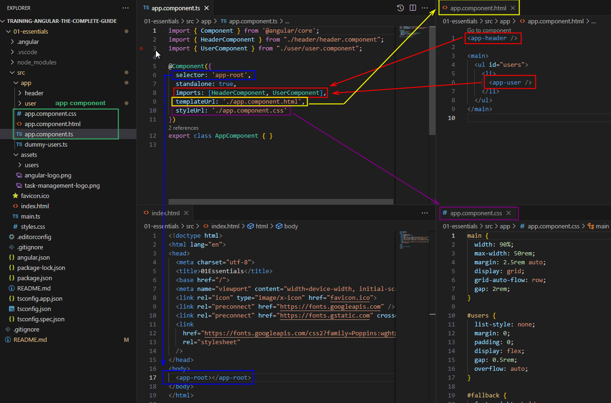
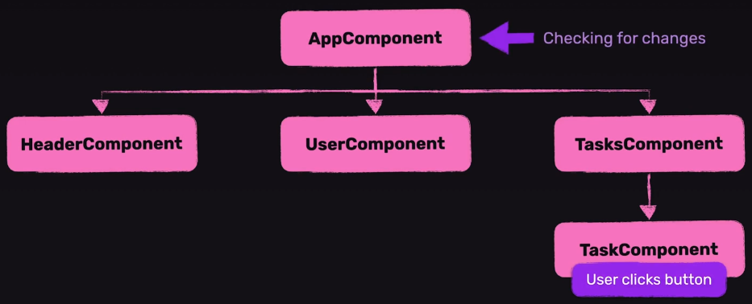
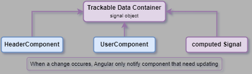

# Angular - The Complete Guide Training

This repo is created for own use based on [Udemy Angular - The Complete Guide (2024 Edition)](https://www.udemy.com/course/the-complete-guide-to-angular-2).

Angular is a frontend JavaScript framework, which helps to building interactive, modern web user interfaces. It's also a collection of tools and features, CLI, debugging tools, IDE plugins, etc.
It can simplify the process of building complex, interactive web user interfaces.
(Declarative coding, separation of concerns via components, OOP concepts and principles.)

## Creating an Angular Project

Angular development requires to install **Node.js**: [Download Node.js®](https://nodejs.org/en/download/prebuilt-installer)

Install Angular CLI tool: `npm install -g @angular/cli`

Create a new Angular project:

- `ng new first-angular-app`
- Stylesheet format: **CSS**
- Enable Server-Side Rendering (SSR): **No**

Recommended development editor: [Visual Studio Code editor](https://code.visualstudio.com/)  
Recommended extensions for VSCode: [Angular Essentials](https://marketplace.visualstudio.com/items?itemName=johnpapa.angular-essentials)

Running the code:

1. Install dependencies: `npm install`
2. Run the development server: `npm start` or `ng serve`

## Using Angular CLI

|Description                 |Script                   |Comment                                  |
|----------------------------|-------------------------|-----------------------------------------|
|Create a new project        |`ng new <app-name>`      |A new folder will be created for project.|
|Generate a new component    |`ng g c <component-name>`|                                         |

## Working with Angular

Angular uses component base separation. How to connect components together:


### Data binding and change detection

#### Change detection mechanism by Zone.js

```ts
// create a public property
selectedUser = USERS[index];

// use getter to create a property with calculated data
get imagePath() {
  return 'assets/users/' + this.selectedUser.avatar;
}

// handler user event in code
onSelectUser() {
  console.log('Clicked');
}
```

Data binding in template:

```html
<div>
  <button (click)="onSelectUser()" > <!-- Event binding -->
     <!-- Property binding -->
    <span>{{ selectedUser.name }}</span> <!-- Binding with string interpolation -->
  </button>
</div>
```

Under the hood, Angular uses zone.js by default for change detection, error handling, async tracking.  
Zone.js notifies Angular about user events, expired timers, etc.  
When a new event occurs, Angular checks for changes for all components within a zone in the order of hierarchy levels, from the root app component to the last component.


A zone related to a component hierarchy which connected to a page.

#### Managing state and changing data with Signals

> Signals has supported since **Angular v16**.

There is another option for updating state. Using **Signals** to notify Angular about value changes and required UI updates.  
A signal is an object that stores a value (any type of value, including nested objects).

```ts
// import
import { signal } from '@angular/core';

// create a new signal object
selectedUser = signal(USERS[index]);

// set/change value
selectedUser.set(USERS[2]);

// get value
const name = selectedUser().name;

// computed value based on a signal
const imagePath = computed(() => 'assets/users/' + this.selectedUser().avatar);
```

Data Binding in template:

```html
<div>
  <button (click)="onSelectUser()" > <!-- Event binding -->
     <!-- Property binding -->
    <span>{{ selectedUser().name }}</span> <!-- Binding with string interpolation -->
  </button>
</div>
```

Angular manages subscriptions to the signal to get notified about changes. When a change occurs, Angular is then **able to update the part of the UI** that needs updating.


### Component Inputs

Using property decorator to create an input to get data from parent component.

```ts
// create property with Input decorator
// using required option if it is mandatory to use in the parent template
@Input({ required: true }) name!: string;
```

Passing data with property binding from a parent component:

```html
<app-user [name]="users[0].name" />
```

#### Signal Inputs

Using Signals instead of input decorator:

```ts
// input data container via Signals
name = input.required<string>();
propertyWithDefaultValue = input('defaultValue');
optionalProperty = input<number>();
```

### Component Outputs (events)

Using property decorator to create an output to notify a parent component about changes.

```ts
// create event with Output decorator
@Output() select = new EventEmitter();

// emit event
onSelectUser() {
  this.select.emit(this.id);
}
```

```html
<button (click)="onSelectUser()"> <!-- binding event handler -->
```

Add event listener in parent component:

```ts
// create handler to process event emitted by a child component
onSelectUser(id: string) {
    console.log('Selected user with id ' + id);
  }
```

```html
<!-- binding select event of a child component -->
<app-user ... (select)="onSelectUser($event)" /> <!-- using a special $event object to pass data -->
```

#### output function

There is another option for define an output event with output function.

```ts
// create event with Output decorator
select = output<string>();

// emit event
onSelectUser() { this.select.emit(this.id); }
```

It is not a Signal! The same event will be created as with Output decorator, but with this solution the Output decorator can be omitted.  
It is recommended to use this then input signal was used.
