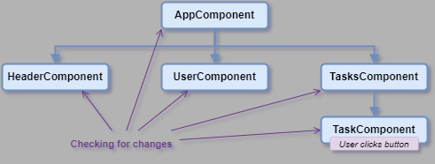

# Angular - The Complete Guide Training

This repo is created for own use based on [Udemy Angular - The Complete Guide (2024 Edition)](https://www.udemy.com/course/the-complete-guide-to-angular-2).

Angular is a frontend JavaScript framework, which helps to building interactive, modern web user interfaces. It's also a collection of tools and features, CLI, debugging tools, IDE plugins, etc.
It can simplify the process of building complex, interactive web user interfaces.
(Declarative coding, separation of concerns via components, OOP concepts and principles.)

## Creating an Angular Project

Angular development requires to install **Node.js**: [Download Node.js®](https://nodejs.org/en/download/prebuilt-installer)

Install Angular CLI tool: `npm install -g @angular/cli`

Create a new Angular project:

- `ng new first-angular-app`
- Stylesheet format: **CSS**
- Enable Server-Side Rendering (SSR): **No**

Recommended development editor: [Visual Studio Code editor](https://code.visualstudio.com/)  
Recommended extensions for VSCode: [Angular Essentials](https://marketplace.visualstudio.com/items?itemName=johnpapa.angular-essentials)

Running the code:

1. Install dependencies: `npm install`
2. Run the development server: `npm start` or `ng serve`

## Using Angular CLI

|Description                 |Script                   |Comment                                  |
|----------------------------|-------------------------|-----------------------------------------|
|Create a new project        |`ng new <app-name>`      |A new folder will be created for project.|
|Generate a new component    |`ng g c <component-name>`|                                         |

## Working with Angular

Angular uses component base separation. How to connect components together:


### Template features

|Description                      |Script                         |
|---------------------------------|-------------------------------|
|Binding with string interpolation|`{{ object.property }}`        |
|Property binding                 |``|
|Event binding                    |`<button (click)="onClick()" >`|

### Change detection mechanism

#### Zone.js

Under the hood, Angular uses zone.js by default for change detection, error handling, async tracking.  
Zone.js notifies Angular about user events, expired timers, etc.  
When a new event occurs, Angular checks for changes for all components within a zone in the order of hierarchy levels, from the root app component to the last component.


A zone related to a component hierarchy which connected to a page.

#### Signals

There is another option for updating state. Using **Signals** to notify Angular about value changes and required UI updates.  
Signals has supported since Angular 16.

A signal is an object that stores a value (any type of value, including nested objects).

Angular manages subscriptions to the signal to get notified about changes. When a change occurs, Angular is then **able to update the part of the UI** that needs updating.

Using Signals in code:

```js
// import
import { signal } from '@angular/core';

// create a new signal object
selectedUser = signal(USERS[index]);

// set/change value
selectedUser.set(USERS[2]);

// get value
const name = selectedUser().name;

// computed value based on a signal
const imagePath = computed(() => 'assets/users/' + this.selectedUser().avatar);
```

Binding in template: `<div>{{ selectedUser().name }}</div>`
